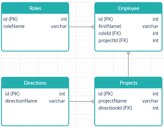
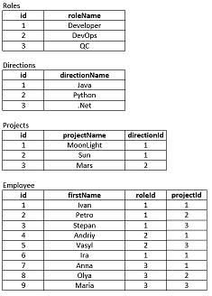

# JDBC
Practise tasks
<pre>
Develop a database with tables Roles, Employee, Directions and Projects.

The Roles table contains the id (primary key), roleName.
The Directions table contains the id (primary key), directionName.
The Projects table contains id (primary key), projectName, directionId (foreign key).
The Employee table contains id (primary key), firstName, roleId (foreign key), projectId (foreign key).

Create next methods of the MyUtils class:

public Connection createConnection() throws SQLException
public void closeConnection() throws SQLException
public Statement createStatement() throws SQLException
public void closeStatement() throws SQLException
public void createSchema(String schemaName) throws SQLException
public void dropSchema() throws SQLException
public void useSchema() throws SQLException

Methods for creating tables:

public void createTableRoles() throws SQLException
public void createTableDirections() throws SQLException
public void createTableProjects() throws SQLException
public void createTableEmployee() throws SQLException
public void dropTable(String tableName) throws SQLException

Methods for insert data to tables:

public void insertTableRoles(String roleName) throws SQLException
public void insertTableDirections(String directionName) throws SQLException
public void insertTableProjects(String projectName, String directionName) throws SQLException
public void insertTableEmployee(String firstName, String roleName, String projectName) throws SQLException

Methods to obtaining data from tables:

public int getRoleId(String roleName) throws SQLException
public int getDirectionId(String directionName) throws SQLException
public int getProjectId(String projectName) throws SQLException
public int getEmployeeId(String firstName) throws SQLException
public List<String> getAllRoles() throws SQLException
public List<String> getAllDirestion() throws SQLException
public List<String> getAllProjects() throws SQLException
public List<String> getAllEmployee() throws SQLException
public List<String> getAllDevelopers() throws SQLException
public List<String> getAllJavaProjects() throws SQLException
public List<String> getAllJavaDevelopers() throws SQLException

For example, for a given data

You must receive getAllJavaDevelopers() => [Іра, Іван, Петро] .
</pre>
